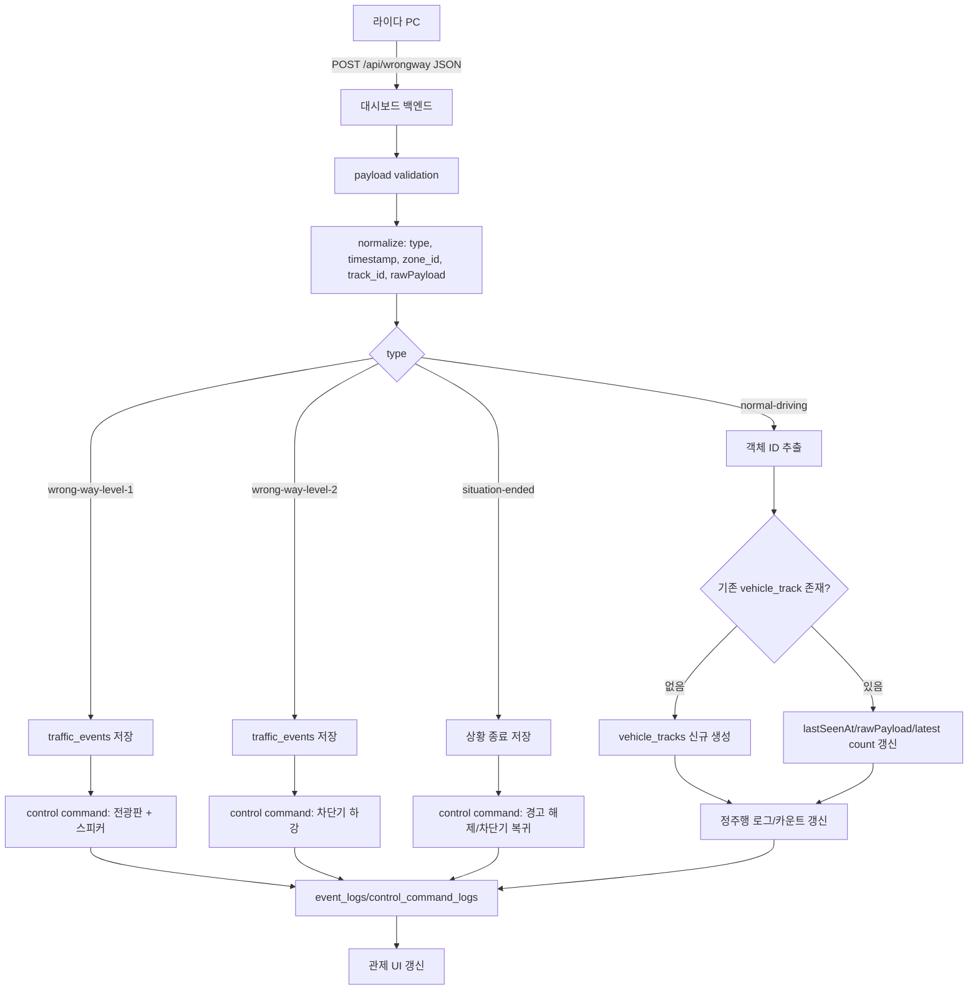
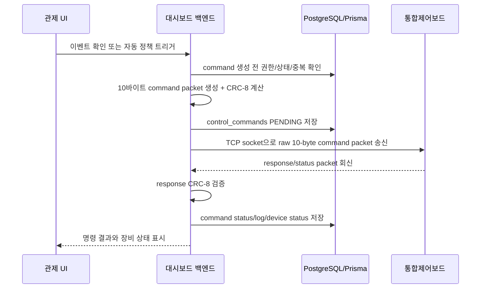

# 역주행 방지 관제 시스템 최신 요구사항

이 문서는 현재 대화에서 확정한 라이다 역주행 대시보드의 최신 개발 기준을 정리한다. 기존 PDF나 과거 문서에 `라이다 PC -> 개발보드`, `RS-485`로 적힌 표현이 있더라도, 이 프로젝트에서는 아래 기준을 우선한다.

## 1. 최신 전제

- 라이다 PC는 대시보드로 역주행/정주행 감지 JSON을 보낸다.
- 대시보드는 라이다 PC 데이터를 수신, 저장, 관제 화면에 표시한다.
- 대시보드는 역주행 방지 시스템 동작을 위해 통합제어보드로 제어 명령을 보낸다.
- 통합제어보드는 대시보드 명령을 받아 전광판, 스피커, 차단기 등 물리 장비를 제어한다.
- 대시보드와 통합제어보드 간 실제 통신은 UTP 케이블 기반 이더넷 통신을 예정한다.
- 통합제어보드 Ethernet transport는 TCP socket 방식을 기본으로 한다. UDP는 유실 가능성 때문에 기본안에서 제외하고, HTTP bridge는 테스트/보조 adapter 후보로만 둔다.
- 대시보드는 PDF의 10바이트 binary frame을 별도 wrapper 없이 TCP payload로 그대로 전송하는 방식을 기본으로 한다.
- 첨부 PDF의 10바이트 고정 패킷과 CRC-8 규격은 통합제어보드 명령/응답 프레임 참고 규격으로 사용한다.
- PDF에 적힌 방향이 `라이다 PC -> 개발보드`처럼 되어 있어도, 본 프로젝트에서는 `대시보드 -> 통합제어보드` 명령 프로토콜로 재해석한다.
- 현재 코드에 남아 있는 `RS-485`, `serial`, `control-board/serial/test` 명칭은 과거/초기 구현 명칭일 수 있으므로, 후속 개발에서 UTP Ethernet transport 기준으로 정리한다.

## 2. 시스템 주체와 책임

| 주체 | 책임 |
| --- | --- |
| 라이다 PC | 정밀도로지도 기준 차량 주행 방향 판단, 정주행/역주행 감지 JSON 전송 |
| 대시보드 백엔드 | JSON 수신, 정규화, 중복/객체 ID 비교, DB 저장, 통합제어보드 명령 생성/송신 |
| 대시보드 프론트엔드 | 현장 관제, 이벤트/상태/차량 수/장비 제어 상태 표시 |
| 통합제어보드 | 대시보드 명령을 받아 전광판, 스피커, 차단기 물리 제어 |
| PostgreSQL/Prisma | 차량 track, 역주행 이벤트, 명령 로그, 장비 상태 저장 |
| Nginx | 납품/운영 시 reverse proxy, TLS, WebSocket/API 프록시, 보안 헤더 담당 후보 |

## 3. 라이다 PC -> 대시보드 JSON 정책

라이다 PC는 대시보드의 `POST /api/wrongway`로 HTTP JSON을 전송한다.

### 3.1 type 기준

| type | 의미 | 저장/제어 정책 |
| --- | --- | --- |
| `normal-driving` | 정주행 차량 감지 | 객체 ID 기준 최초 1회만 차량 track DB 저장, 이후 1초 간격 데이터는 최신 상태 갱신 중심 |
| `wrong-way-level-1` | 역주행 1차 감지 | 역주행 이벤트 저장, 통합제어보드에 1차 경고 명령 송신 |
| `wrong-way-level-2` | 역주행 2차 감지 | 역주행 이벤트 저장, 통합제어보드에 2차 차단 명령 송신 |
| `situation-ended` | 상황 종료 | 상황 종료 이벤트/로그 저장, 통합제어보드에 해제/복귀 명령 송신 |

### 3.2 예상 JSON 예시

```json
{
  "type": "wrong-way-level-1",
  "warning_level": 1,
  "timestamp": "2026-01-13T14:43:54.360258+09:00",
  "confidence": 0.95,
  "zone_id": "Z327",
  "track_id": "81760000-0000-0000-0000-000000000000",
  "message": "역주행 1차 감지",
  "speed_ms": 2.835765050970876,
  "speed_kmh": 10.208754183495154,
  "object_class": 6,
  "uuid": "81760000",
  "description": "Wrong-way driving detected",
  "consecutive_count": 3,
  "is_confirmed": true,
  "normal_moving_vehicle_count": 2
}
```

### 3.3 정주행 데이터 저장 정책

- 라이다 PC는 정주행 차량 데이터를 1초 간격으로 계속 보낼 수 있다.
- 정주행 데이터는 그대로 모두 `traffic_events`에 쌓지 않는다.
- `track_id`, `uuid`, `object_id`, `stable_object_id` 중 사용 가능한 객체 식별자를 기준으로 같은 차량인지 판단한다.
- 같은 객체 ID의 정주행 데이터가 반복 수신되면 최초 데이터만 신규 track으로 저장하고, 이후 데이터는 `vehicle_tracks.lastSeenAt`, `lastEventType`, `lastNormalMovingVehicleCount`, `rawPayload` 등 최신 상태 갱신에 사용한다.
- 객체 ID가 없는 정주행 payload는 운영 정책에 따라 저장을 제한하거나 별도 진단 로그로 남긴다.
- 차량 수 카운트는 `normal_moving_vehicle_count` 수신값과 DB 기준 unique track count를 구분해 표시한다.
- 공식 차량 수 지표는 DB unique track count를 우선한다. 라이다가 보내는 count 값은 참고/비교값으로 저장 또는 표시한다.

## 4. 역주행 제어 정책

대시보드는 라이다 PC가 보내는 역주행 감지 JSON을 기준으로 통합제어보드에 명령을 송신한다. 대시보드가 통합제어보드를 거치지 않고 차단기/전광판/스피커를 직접 제어하지 않는다.

| 단계 | 라이다 수신 이벤트 | 대시보드 처리 | 통합제어보드 명령 의도 |
| --- | --- | --- | --- |
| 정상 | `normal-driving` | 차량 track 갱신, 차량 수 집계 | 없음 |
| 1차 | `wrong-way-level-1` | 이벤트 저장, 관제 알림, 명령 로그 생성 | 전광판 + 스피커 경고 |
| 2차 | `wrong-way-level-2` | 이벤트 저장, 위험 단계 상승, 명령 로그 생성 | 차단기 하강, 진입 차단 |
| 종료 | `situation-ended` | 상황 종료 처리, 명령 로그 생성 | 차단기 복귀/상승, 경고 해제 |

## 5. 통합제어보드 명령 프레임

첨부 PDF 기준 프레임은 10바이트 고정이며, CRC-8로 무결성을 검증한다. 실제 전송 transport는 UTP 기반 이더넷 통신을 우선 기준으로 한다.

통합제어보드 송신 기본안:

- transport: TCP socket
- payload: 10바이트 binary frame raw 전송
- IP/port: `.env`에서 관리
- timeout/retry/heartbeat: `.env` 또는 서버 설정에서 관리
- 기본 개발 모드: 실제 장비가 없으면 mock/loopback adapter 사용
- 실제 연동 모드: 현장 테스트 때 사용자가 `.env`에 실제 IP/port와 mode 값을 입력

| Byte | 필드 | 의미 |
| --- | --- | --- |
| 0 | STX | `0x02`, 패킷 시작 |
| 1 | ID | `0xA1`, 장비 식별 ID |
| 2 | TYPE | `0x10` 명령, `0x20` 응답/로그 |
| 3 | MODE | `0x00` 대기, `0x01` 1차, `0x02` 2차 |
| 4 | STATUS | `0x00` OFF, `0x01` ON, `0x02` 차단기 복귀/상승 |
| 5 | SELECT | 제어 대상 선택 |
| 6 | RESERVED | `0x00`, 예약 |
| 7 | CRC | Byte 1~6에 대한 CRC-8 계산값 |
| 8 | ETX | `0x03`, 패킷 종료 |
| 9 | EOF | `0x0D`, CR |

### 5.1 SELECT 값

| 값 | 의미 |
| --- | --- |
| `0x01` | 전체 |
| `0x02` | 경보 세트, LED + 스피커 |
| `0x03` | 안전 세트, LED + 차단기 |
| `0x10` | LED 전광판 단독 |
| `0x11` | 스피커 단독 |
| `0x12` | 차단기 단독 |

### 5.2 PDF 기준 시나리오 예시

| 시나리오 | 의도 | PC/대시보드 송신 명령 | 보드 응답 |
| --- | --- | --- | --- |
| 1차 경고 시작 | 전광판/스피커 가동 | `02 A1 10 01 01 02 00 9B 03 0D` | `02 A1 20 01 01 02 00 CD 03 0D` |
| 2차 경고 시작 | 차단기 하강 | `02 A1 10 02 01 02 00 A1 03 0D` | `02 A1 20 02 01 02 00 F7 03 0D` |
| 2차 복귀/해제 | 차단기 상승, 상황 종료 | `02 A1 10 02 02 02 00 1C 03 0D` | `02 A1 20 02 02 02 00 4A 03 0D` |
| 전체 시스템 리셋 | 모든 경보 해제, 대기 | `02 A1 10 00 00 02 00 E6 03 0D` | `02 A1 20 00 00 02 00 B0 03 0D` |

### 5.3 CRC-8 기준

- 알고리즘: CRC-8/SMBUS
- Polynomial: `0x07`
- Initial Value: `0x00`
- Reflect In/Out: `false`
- XOR Out: `0x00`
- 계산 범위: Byte 1~6
- 제외 항목: STX, CRC byte, ETX, EOF

## 6. DB 설계 및 저장 방향

Prisma ORM을 기준으로 DB를 설계하고 조작한다.

### 6.1 핵심 테이블

| 테이블 | 목적 |
| --- | --- |
| `vehicle_tracks` | 차량/객체 ID 기준 track 저장, 정주행 반복 데이터 dedupe 및 최신 상태 갱신 |
| `traffic_events` | 역주행 1차/2차/상황종료 등 관제 이벤트 저장 |
| `event_logs` | 수신, 상태 변경, 메모, 명령, 오류 등 감사 로그 저장 |
| `control_commands` | 대시보드가 통합제어보드로 보낸 명령 요청 저장 후보 |
| `control_command_logs` | 명령 생성, 송신, 응답, 실패, timeout 이력 저장 후보 |
| `device_status_logs` | 통합제어보드/장비 상태 변화 저장 후보 |

### 6.2 수신 처리 로직



## 7. 통합제어보드 명령 lifecycle



## 8. 환경변수/설정 방향

실제 내부망 정보는 코드와 문서에 고정하지 않고 `.env`에서 관리한다. 사용자가 현장 테스트 시 직접 입력한다.

예상 설정 항목:

```text
CONTROL_BOARD_TRANSPORT=tcp
CONTROL_BOARD_HOST=replace_with_control_board_ip
CONTROL_BOARD_PORT=replace_with_control_board_port
CONTROL_BOARD_CONNECT_TIMEOUT_MS=1000
CONTROL_BOARD_RESPONSE_TIMEOUT_MS=1000
CONTROL_BOARD_RETRY_COUNT=1
CONTROL_BOARD_HEARTBEAT_INTERVAL_MS=5000
CONTROL_BOARD_DRY_RUN=true
```

원칙:

- `CONTROL_BOARD_DRY_RUN=true`를 기본값으로 둔다.
- 실제 장비 연동 시에만 사용자가 `.env`에서 dry-run을 끈다.
- 실제 IP, port, 현장망 정보, 비밀값은 커밋하지 않는다.
- retry는 무한 반복하지 않는다. 차단기/경고 장비 제어는 중복 명령이 위험할 수 있으므로 command idempotency와 로그를 남긴다.

## 9. 테스트 및 에이전트 협업 방향

개발은 멀티에이전트가 서로 검토하면서 반복한다.

| 역할 | 검증/자문 항목 |
| --- | --- |
| PM/Tech Lead | 요구사항 충돌 조정, 브랜치/마일스톤 관리 |
| Backend/DB | Prisma schema, dedupe 로직, command lifecycle, API/Swagger |
| Frontend/UI/UX | 관제 화면 정보 구조, 경보 단계, 장비 상태, 운영자 조작 UX |
| Hardware/Field Control | UTP Ethernet/TCP 연결, raw frame, 패킷/CRC, 통합제어보드 응답, 현장 안전 조건 |
| Security Assurance | JWT, 명령 권한, 감사 로그, 보안 검사, 실제 장비 영향 차단 |
| QA/DevOps | curl/API smoke, packet vector test, Docker/Nginx, 미검증 항목 기록 |
| Delivery/Acceptance | 납품 체크리스트, 현장 검수, 운영 runbook, 증적 패키지 |

### 9.1 에이전트별 1차 작업지시

| 에이전트 | 1차 작업지시 |
| --- | --- |
| PM/Tech Lead | 전체 기능을 `라이다 수신`, `정주행 dedupe`, `역주행 승격`, `통합제어보드 TCP command`, `관제 UI`, `검증/납품` 마일스톤으로 분해한다. |
| Backend/DB | Prisma schema에 `control_commands`, `control_command_logs`, `device_status_logs` 도입 여부를 검토하고, 정주행 unique track count 정책을 구현 계획으로 만든다. |
| Frontend/UI/UX | active incident, 1차/2차 경보, 차량 수, 통합제어보드 TCP 연결 상태, command 결과를 한 화면에서 관제하는 UI 구조를 제안한다. |
| LiDAR Domain | `track_id`, `uuid`, `object_id`, `stable_object_id` 중 dedupe 우선순위와 fallback key를 정의한다. |
| Hardware/Field Control | 10바이트 raw frame, CRC-8, TCP socket 송수신, 보드 response/status 해석, 실제 장비 연결 전 주의사항을 검토한다. |
| Infrastructure/Network | `.env` 기반 `CONTROL_BOARD_HOST`, `PORT`, timeout, retry, heartbeat, dry-run, Nginx proxy 영향을 정리한다. |
| Security Assurance | command 실행 권한, JWT 보호 API, audit log, dry-run 기본값, 실제 장비 active scan 금지 기준을 정리한다. |
| QA/DevOps | 정주행 60초 반복, packet vector, TCP mock server, command retry/timeout, Nginx 경유 smoke 테스트를 설계한다. |
| Delivery/Acceptance | 현장 테스트 시 사용자가 `.env`에 실제 값을 넣고 검수할 체크리스트를 만든다. |

### 9.2 테스트 케이스

- 정주행 같은 `track_id`가 60초 동안 1초 간격으로 들어올 때 `vehicle_tracks`가 1건만 생성되는지 확인한다.
- 정주행 같은 `track_id` 반복 수신 시 `lastSeenAt`과 최신 payload만 갱신되는지 확인한다.
- 서로 다른 `track_id` 정주행은 차량 수 카운트와 track 생성이 증가하는지 확인한다.
- `wrong-way-level-1` 수신 시 1차 경고 command packet이 생성되는지 확인한다.
- 대시보드 승격 조건이 설정된 경우 `wrong-way-level-1` 이후 조건 충족 시 `wrong-way-level-2`로 승격되는지 확인한다.
- `wrong-way-level-2` 상태가 되면 차단기 하강 command packet이 생성되는지 확인한다.
- `situation-ended` 수신 시 복귀/해제 command packet이 생성되는지 확인한다.
- PDF 테스트 벡터 기준 CRC-8 결과가 일치하는지 확인한다.
- 통합제어보드 응답 CRC가 잘못되면 운영 이벤트로 성공 처리하지 않고 오류 로그로 남기는지 확인한다.
- Nginx 경유 운영 URL에서도 `/api/wrongway`, 관제 UI, WebSocket/polling, Swagger 접근 정책이 맞는지 확인한다.
- 보안 검사에서 실제 장비에 영향을 줄 수 있는 active scan은 차단되는지 확인한다.

## 10. 프론트엔드 관제 UI/UX 방향

프론트엔드는 단순 로그 화면이 아니라 역주행 방지 관제 시스템에 맞게 고도화한다.

- 첫 화면에서 현재 현장 상태, 라이다 수신 상태, 통합제어보드 연결 상태, 최근 역주행 이벤트를 즉시 확인한다.
- 1차 경고는 전광판/스피커 동작 상태와 함께 표시한다.
- 2차 경고는 차단기 하강 상태, 위험도, 운영자 확인 상태를 더 강하게 표시한다.
- 정주행 차량 수는 라이다 제공 count와 DB unique track count를 구분해서 표시한다.
- 이벤트 상세에서 원본 JSON, normalized event, 명령 packet, CRC 결과, 보드 응답을 확인할 수 있게 한다.
- mock, 미연동, 미검증 상태는 실제 연동처럼 보이지 않게 명확히 표시한다.
- 운영자는 이벤트 확인, 메모, 상황 종료, 수동 명령 재시도 여부를 추적할 수 있어야 한다.
- 모바일/태블릿에서도 활성 경보와 장비 상태는 깨지지 않아야 한다.

## 11. 개발 우선순위

1. 라이다 JSON 수신/정규화와 정주행 객체 ID dedupe 저장 로직 확정
2. 역주행 1차/2차/종료 이벤트 저장과 command lifecycle 설계
3. PDF 기준 10바이트 packet 생성/CRC-8 테스트 벡터 검증
4. 통합제어보드 UTP Ethernet/TCP socket raw frame 송신 adapter 설계
5. 관제 UI/UX 고도화
6. Swagger/API 문서와 Prisma migration 정리
7. Nginx 운영 구성, 보안 검사, 납품 runbook 정리
8. 멀티에이전트 기반 테스트/피드백 루프 반복

## 12. 확정 사항

- 통합제어보드 Ethernet 방식은 TCP socket을 기본으로 한다.
- 통합제어보드 payload는 10바이트 binary frame을 raw TCP payload로 보낸다.
- IP/port/timeout/retry/heartbeat는 `.env`에서 관리한다.
- 정주행 객체 ID는 안정적으로 제공되는 것으로 본다.
- 정주행 차량 수 공식 지표는 DB unique track count를 우선한다.
- `wrong-way-level-2`는 대시보드가 조건 기반으로 승격하는 방향이다. 단, 승격 기준은 추후 측량/현장 기준 확정 후 구현한다.
- 장비 자체 test/safety mode는 없으므로, 대시보드 소프트웨어에서 dry-run/mock/loopback adapter를 제공한다.

## 13. 미확정/확인 필요

- 통합제어보드 실제 IP/port 값
- TCP server/client 역할: 대시보드가 client로 접속할지, 통합제어보드가 대시보드에 접속할지 확인 필요
- heartbeat packet이 별도 정의되어야 하는지, 단순 health command를 사용할지 확인 필요
- command ack/response timeout 기준
- `wrong-way-level-2` 승격 측량 기준
- 정주행 객체 ID 외 보조 dedupe key 조합: `track_id + zone_id`, `uuid`, timestamp bucket 등
- 실제 장비 연결 시 현장 안전 절차와 운영자 승인 절차
