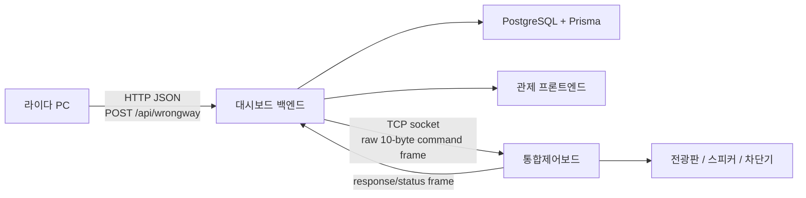

# 멀티에이전틱 프로그래밍 컨텍스트 정리

이 문서는 라이다 역주행 대시보드 프로젝트에서 지금까지 사용자와 Codex가 합의한 시스템 컨텍스트, 역할 분배, 개발 계획, 멀티에이전트 운영 방식을 다음 세션과 팀 공유에 재사용하기 위해 정리한 문서다.

## 1. 프로젝트 한 줄 정의

월출산휴게소 회전교차로 역주행 방지 관제 시스템을 개발한다.

라이다 PC가 정밀도로지도 기반으로 정주행/역주행 차량을 판단해 대시보드로 JSON을 보내고, 대시보드는 이를 DB에 저장하고 관제 UI에 표시하며, 필요 시 통합제어보드로 명령을 보내 전광판, 스피커, 차단기를 제어한다.

## 2. 전체 시스템 흐름



핵심 통신 방향:

- 라이다 PC -> 대시보드: HTTP JSON
- 대시보드 -> 통합제어보드: UTP Ethernet 기반 TCP socket
- 통합제어보드 -> 대시보드: response/status frame
- 대시보드 -> DB: Prisma ORM
- 대시보드 -> 관제 UI: REST API, WebSocket 또는 polling fallback

## 3. 라이다 PC 입력 데이터 컨텍스트

라이다 PC는 차량 주행 방향 판단을 수행한 뒤 대시보드로 결과 JSON을 보낸다. 대시보드는 라이다 판단을 다시 수행하지 않고, 수신값을 저장/표시/제어 트리거에 사용한다.

endpoint:

```text
POST /api/wrongway
Content-Type: application/json
```

지원 type:

| type | 의미 | 대시보드 처리 |
| --- | --- | --- |
| `normal-driving` | 정주행 차량 감지 | 객체 ID 기준 dedupe, 차량 track 최신 상태 갱신 |
| `wrong-way-level-1` | 역주행 1차 감지 | 이벤트 저장, 1차 경고 명령 생성 |
| `wrong-way-level-2` | 역주행 2차 상태 | 이벤트 저장, 차단기 하강 명령 생성 |
| `situation-ended` | 상황 종료 | 종료 처리, 복귀/해제 명령 생성 |

예상 payload:

```json
{
  "type": "wrong-way-level-1",
  "warning_level": 1,
  "timestamp": "2026-01-13T14:43:54.360258+09:00",
  "confidence": 0.95,
  "zone_id": "Z327",
  "track_id": "81760000-0000-0000-0000-000000000000",
  "message": "역주행 1차 감지",
  "speed_ms": 2.835765050970876,
  "speed_kmh": 10.208754183495154,
  "object_class": 6,
  "uuid": "81760000",
  "description": "Wrong-way driving detected",
  "consecutive_count": 3,
  "is_confirmed": true,
  "normal_moving_vehicle_count": 2
}
```

## 4. 정주행 데이터 저장 정책

사용자 확정 사항:

- 정주행 데이터는 1초 간격으로 계속 들어온다.
- 정주행 payload에는 안정적인 객체 ID가 계속 제공된다.
- 정주행 데이터를 모두 이벤트로 쌓으면 DB가 불필요하게 커지므로 dedupe가 필요하다.
- 공식 차량 수는 라이다 제공 count가 아니라 DB unique track count를 기준으로 한다.

정책:

- `track_id`, `uuid`, `object_id`, `stable_object_id`를 객체 식별자 후보로 사용한다.
- 같은 객체 ID가 이미 있으면 새 `traffic_events`를 만들지 않고 `vehicle_tracks` 최신 상태만 갱신한다.
- 최초 수신 객체만 `vehicle_tracks`에 생성한다.
- 반복 수신 데이터는 `lastSeenAt`, `lastEventType`, `lastNormalMovingVehicleCount`, `rawPayload` 등을 갱신한다.
- 라이다의 `normal_moving_vehicle_count`는 참고/비교값으로 저장 또는 표시한다.

## 5. 역주행 제어 정책

대시보드는 통합제어보드로 명령을 보내는 주체다. 실제 전광판, 스피커, 차단기 물리 제어는 통합제어보드가 담당한다.

| 단계 | 트리거 | 대시보드 처리 | 통합제어보드 명령 |
| --- | --- | --- | --- |
| 정상 | `normal-driving` | track 갱신, 차량 수 집계 | 없음 |
| 1차 | `wrong-way-level-1` | 이벤트 저장, 관제 알림, 명령 로그 | 전광판 + 스피커 경고 |
| 2차 | 대시보드 조건 기반 승격 예정 | 위험 단계 상승, 명령 로그 | 차단기 하강 |
| 종료 | `situation-ended` | 상황 종료, 명령 로그 | 차단기 복귀/상승, 경고 해제 |

중요한 결정:

- `wrong-way-level-2`는 최종적으로 대시보드가 일정 조건으로 승격하는 방향이다.
- 다만 승격 기준은 아직 측량/현장 기준이 확정되지 않았으므로 후속으로 주입한다.

## 6. 통합제어보드 통신 컨텍스트

첨부 PDF에는 `라이다 PC -> 개발보드`, `RS-485`로 표현되어 있었으나, 프로젝트의 최종 기준은 다음과 같다.

- 실제 방향: 대시보드 -> 통합제어보드
- 실제 매체: UTP Ethernet
- application transport: TCP socket 기본
- UDP: 유실 가능성이 있어 기본안에서 제외
- HTTP bridge: 테스트 또는 보조 adapter 후보
- payload: 10바이트 binary frame을 별도 wrapper 없이 raw TCP payload로 전송
- 실제 IP/port/timeout/retry/heartbeat/dry-run은 `.env`로 관리
- 통합제어보드 자체 test/safety mode는 없음
- 따라서 소프트웨어에서 dry-run/mock/loopback adapter를 기본 보호장치로 제공한다.

예상 `.env` 항목:

```text
CONTROL_BOARD_TRANSPORT=tcp
CONTROL_BOARD_HOST=replace_with_control_board_ip
CONTROL_BOARD_PORT=replace_with_control_board_port
CONTROL_BOARD_CONNECT_TIMEOUT_MS=1000
CONTROL_BOARD_RESPONSE_TIMEOUT_MS=1000
CONTROL_BOARD_RETRY_COUNT=1
CONTROL_BOARD_HEARTBEAT_INTERVAL_MS=5000
CONTROL_BOARD_DRY_RUN=true
```

## 7. 10바이트 frame과 CRC

PDF에서 추출한 10바이트 frame은 통합제어보드 command/response frame 참고 규격으로 사용한다.

| Byte | 필드 | 의미 |
| --- | --- | --- |
| 0 | STX | `0x02`, 패킷 시작 |
| 1 | ID | `0xA1`, 장비 식별 ID |
| 2 | TYPE | `0x10` command, `0x20` response/log |
| 3 | MODE | `0x00` 대기, `0x01` 1차, `0x02` 2차 |
| 4 | STATUS | `0x00` OFF, `0x01` ON, `0x02` 차단기 복귀/상승 |
| 5 | SELECT | 제어 대상 선택 |
| 6 | RESERVED | `0x00` |
| 7 | CRC | Byte 1~6에 대한 CRC-8 |
| 8 | ETX | `0x03` |
| 9 | EOF | `0x0D` |

CRC 기준:

- CRC-8/SMBUS
- Polynomial: `0x07`
- Initial value: `0x00`
- Reflect In/Out: false
- XOR Out: `0x00`
- 계산 범위: Byte 1~6
- 제외: STX, CRC byte, ETX, EOF

테스트 벡터:

| 의도 | command | response |
| --- | --- | --- |
| 1차 경고 | `02 A1 10 01 01 02 00 9B 03 0D` | `02 A1 20 01 01 02 00 CD 03 0D` |
| 2차 경고/차단기 하강 | `02 A1 10 02 01 02 00 A1 03 0D` | `02 A1 20 02 01 02 00 F7 03 0D` |
| 복귀/해제 | `02 A1 10 02 02 02 00 1C 03 0D` | `02 A1 20 02 02 02 00 4A 03 0D` |
| 전체 리셋 | `02 A1 10 00 00 02 00 E6 03 0D` | `02 A1 20 00 00 02 00 B0 03 0D` |

## 8. DB/ORM 설계 방향

Prisma + PostgreSQL 기준으로 설계한다.

현재/후보 테이블:

| 테이블 | 목적 |
| --- | --- |
| `vehicle_tracks` | 객체 ID 기준 차량 track 저장, 정주행 dedupe |
| `traffic_events` | 역주행 1차/2차/종료 이벤트 저장 |
| `event_logs` | 수신, 상태 변경, 메모, 오류, 감사 로그 |
| `control_commands` | 대시보드가 보낸 통합제어보드 명령 |
| `control_command_logs` | 명령 생성, 송신, 응답, 실패, timeout 이력 |
| `device_status_logs` | 통합제어보드/장비 상태 변화 |

DB 접근은 Prisma ORM 중심으로 한다. raw SQL은 꼭 필요한 경우에만 사용한다.

## 9. API/문서화 방향

- API 문서는 Swagger/OpenAPI로 관리한다.
- route/controller/service 구현과 Swagger를 함께 갱신한다.
- 라이다 수신, 이벤트 조회, 명령 송신, 장비 상태, health, auth API를 문서화한다.
- 현장 테스트용 curl 예시를 README/docs에 유지한다.
- 검증하지 않은 API 동작은 `미검증`으로 표시한다.

## 10. 프론트엔드 관제 UI 방향

프론트는 단순 로그 화면이 아니라 현장 관제 시스템으로 고도화한다.

필수 화면/표현:

- 현재 위험 상태
- 최근 역주행 이벤트
- 라이다 수신 상태
- 통합제어보드 TCP 연결 상태
- 1차 전광판/스피커 동작 상태
- 2차 차단기 하강 상태
- 상황 종료/복귀 상태
- 정주행 차량 수: DB unique track count 기준
- 원본 JSON, normalized event, command packet, CRC 결과, board response
- mock/dry-run/미연동/미검증 상태 구분

UI/UX 개선은 적극 허용한다. 단, 제공되지 않는 CCTV/번호판/차량 소유자 정보는 있는 것처럼 표시하지 않는다.

## 11. 인증/보안/운영 방향

- 운영 화면은 JWT 로그인 기반으로 계획한다.
- `/api/wrongway`는 라이다 PC ingest API이므로 JWT 보호 대상에서 제외한다.
- 운영자용 API/UI는 JWT 보호 대상이다.
- 장비 ingest/제어 보안은 별도 device key, IP allowlist, 네트워크 정책을 후속으로 검토한다.
- 실제 비밀값, IP, port, 인증서, JWT secret은 코드/문서/커밋에 남기지 않는다.
- 납품/운영 구성에서는 Nginx reverse proxy를 검토한다.
- 보안 검사는 dependency audit, secret scan, container scan, SAST 후보, OWASP ZAP Baseline 같은 DAST 후보를 검토한다.
- 실제 장비에 영향을 줄 수 있는 active scan은 별도 안전 조건 전까지 금지한다.

## 12. 멀티에이전트 역할 분배

각 에이전트는 단순 작업자가 아니라 전문가로 행동한다.

| 역할 | 전문가 정체성 |
| --- | --- |
| PM / 오케스트레이터 | 현장 납품형 제품 관리자 |
| Tech Lead / Architect | 시스템 아키텍트 |
| Backend/DB | Express, Prisma, PostgreSQL, Swagger 전문가 |
| Frontend | React 관제 화면 구현 전문가 |
| UI/UX Designer | 교통 관제 UX 디자이너 |
| LiDAR Domain | 라이다/정밀도로지도 도메인 분석가 |
| Hardware / Field Control | 통합제어보드, TCP raw frame, CRC, 현장 장비 자문가 |
| Infrastructure / Network | 내부망, TCP socket, Nginx, 포트, `.env` 설계자 |
| Security Assurance | JWT, 권한, 보안 검사, 감사 로그 전문가 |
| QA / Test | packet vector, smoke, 회귀 검증 전문가 |
| DevOps / Runtime | Docker, Windows, 실행 환경 전문가 |
| Delivery / Acceptance | 납품 검수, runbook, 증적 패키지 전문가 |
| Docs / Release | Swagger, README, curl, 릴리즈 노트 담당 |
| Safety Reviewer | 실제 장비 영향과 위험 명령 차단 담당 |

## 13. 멀티에이전트 협업 루프

```text
1. PM이 목표와 브랜치 후보 선정
2. 도메인/하드웨어/백엔드/프론트/보안/QA가 리스크와 계약 제안
3. Tech Lead가 API, DB, command lifecycle 충돌 조정
4. 구현
5. Swagger/Prisma/UI/테스트 문서 동기화
6. QA/Security/Infra가 검증 또는 미검증 표기
7. 실패 시 원인 분석 후 수정
8. 기능별 브랜치 push
9. 다음 기능으로 이동
```

## 14. 개발 우선순위

1. 라이다 JSON 수신/정규화
2. 정주행 객체 ID dedupe 저장
3. DB unique track count 기반 차량 수 산정
4. 1차 역주행 이벤트 저장 + 전광판/스피커 command 생성
5. 2차 승격 구조 설계
6. 차단기 하강 command 생성
7. 상황 종료/복귀 command 생성
8. TCP socket raw 10-byte frame adapter 구현
9. CRC-8 테스트 벡터 검증
10. 관제 UI/UX 고도화
11. JWT 로그인/운영 권한
12. Swagger/Prisma migration/seed 정리
13. Nginx reverse proxy와 보안검사/납품 runbook

## 15. 남은 미확정

- 통합제어보드 TCP server/client 역할
- 실제 IP/port 값
- heartbeat packet 정의 여부
- command response timeout 기준
- `wrong-way-level-2` 승격 측량 기준
- 실제 장비 연결 시 현장 안전 절차

## 16. 다음 프로젝트에도 재사용할 수 있는 성공 패턴

이번 컨텍스트 주입 방식에서 재사용할 만한 패턴:

1. 전체 시스템 목적을 먼저 설명한다.
2. 실제 데이터 방향과 제어 방향을 명확히 정정한다.
3. 첨부 프로토콜/PDF는 그대로 믿지 않고 현재 프로젝트 기준으로 재해석한다.
4. 데이터 저장 정책과 dedupe 기준을 명확히 지정한다.
5. 하드웨어, 네트워크, 보안, 납품까지 전문가 역할을 나눈다.
6. 미확정 사항을 질문 목록으로 남긴다.
7. 답변이 나오면 확정 사항과 미확정 사항을 문서에서 분리한다.
8. 멀티에이전트가 각자 검토할 기준을 작업지시서로 고정한다.

이 프로젝트는 단순 웹 대시보드가 아니라 `라이다 수신 + 교통 이벤트 저장 + 현장 장비 제어 + 관제 UI + 납품 검증`이 결합된 현장형 시스템이다. 다음 개발 세션에서는 `docs/ai/field-system-requirements.md`와 이 문서를 먼저 읽고 멀티에이전트 역할을 나누면 된다.
